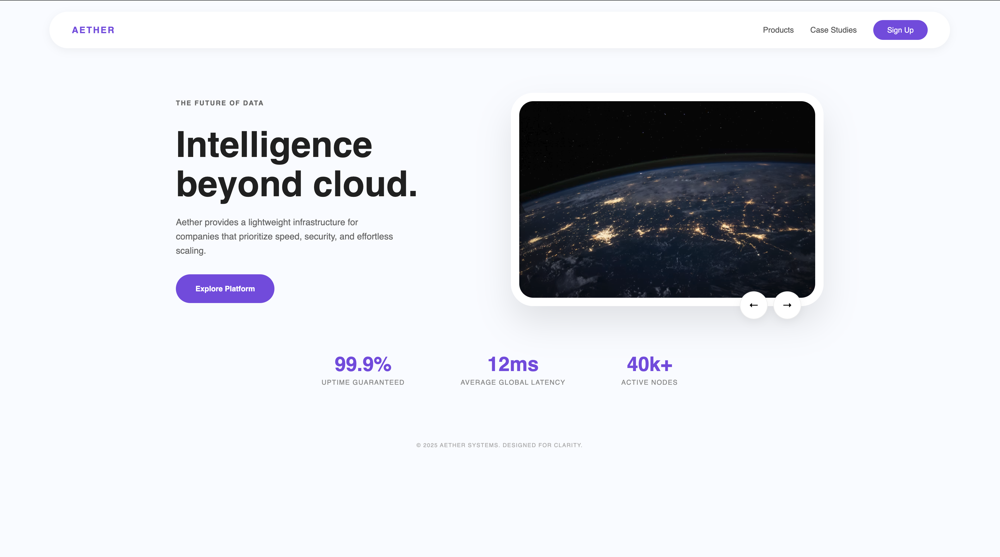
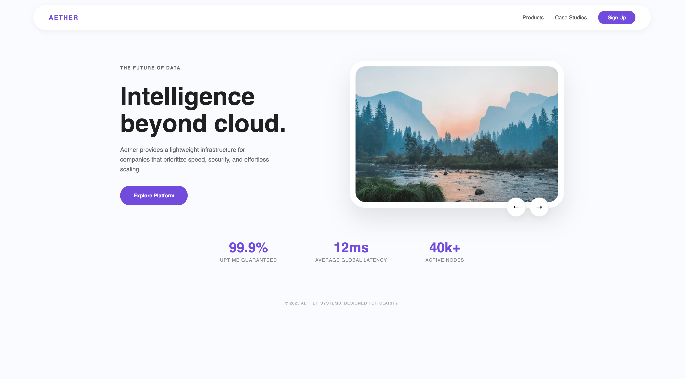
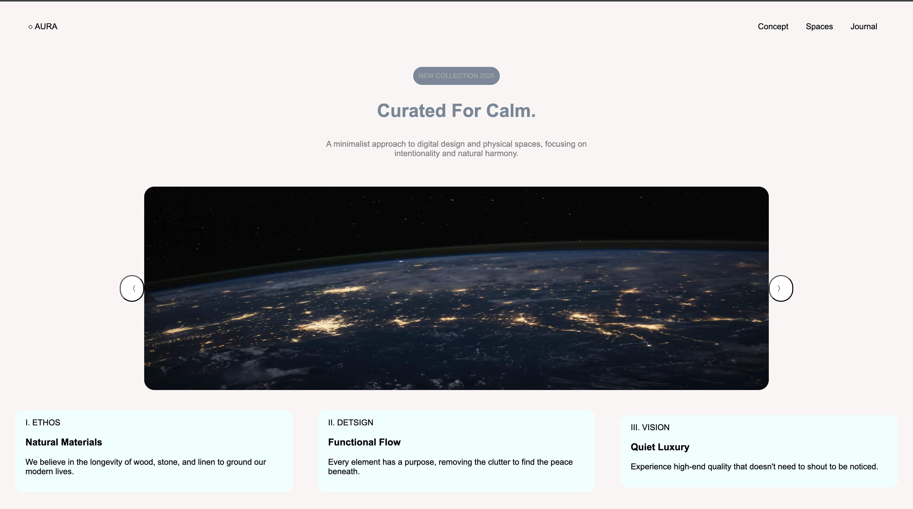
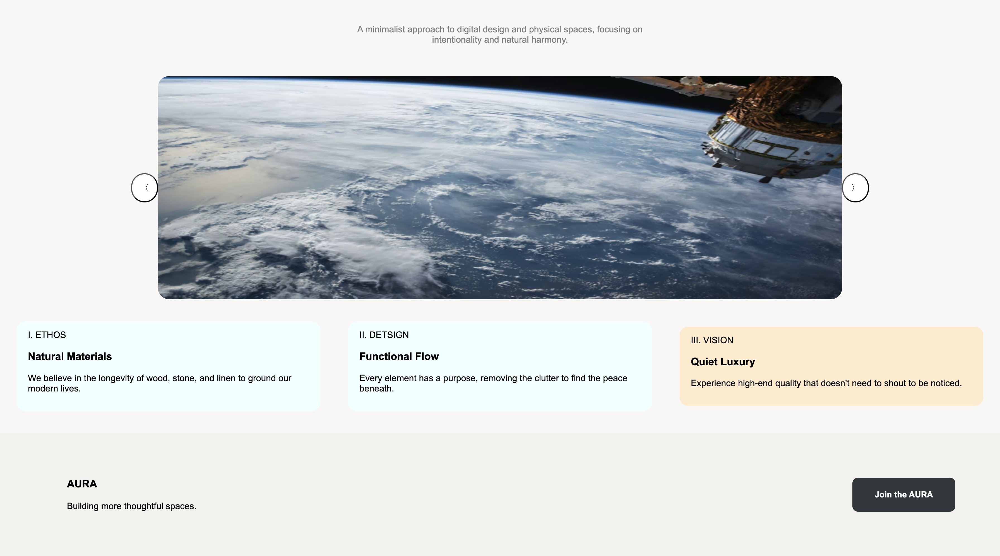

# Landing Pages

Two landing pages built with **HTML**, **CSS**, and **JavaScript** as part of my web development practice.

---

## Preview

### Aether

### Aura

---

## Final1 — Aether
A dark-tech SaaS landing page featuring:
- Floating navbar with sign up button
- Split hero section with image slider
- Stats bar (uptime, latency, nodes)

## Final2 — Aura
A minimalist lifestyle brand page featuring:
- Centered hero with badge and tagline
- Full-width image slider with prev/next controls
- Feature cards section
- Clean split footer

---

## My CSS Journey
Early on, CSS layouts felt overwhelming. The breakthrough came when I started thinking in **boxes** — every element as a container with its own space. Once that clicked, Flexbox became straightforward and layouts started making sense.

These same concepts appeared in my **AICT final exam**, which made the paper feel familiar.

---

## Built With
- HTML
- CSS
- JavaScript (no frameworks)
